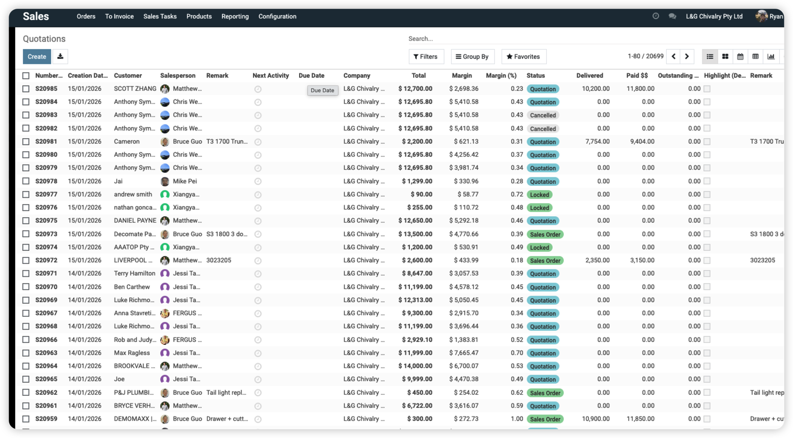

# 
 ODOO User Handbook for Chivalry 

- [ ODOO User Handbook for Chivalry ](#-odoo-user-handbook-for-chivalry-)
  - [Product Management](#product-management)
  - [Sales Process](#sales-process)
    - [Quotation to Confirmed Order](#quotation-to-confirmed-order)
    - [Invoicing](#invoicing)
    - [Payments](#payments)
    - [Delivery Scheduling](#delivery-scheduling)
    - [Delivery](#delivery)
  - [Purchase Process](#purchase-process)
  - [Inventory Management](#inventory-management)
  - [Inter-company transfer](#inter-company-transfer)
  - [Cash Management](#cash-management)
  - [Meta-data Management](#meta-data-management)
    - [Vehicle Models](#vehicle-models)
    - [Packages](#packages)
    - [3D parts](#3d-parts)
  - [Reporting](#reporting)
    - [Sales Report](#sales-report)
    - [Margin Report](#margin-report)
    - [Inventory Report](#inventory-report)

## Product Management

## Sales Process
### Quotation to Confirmed Order
### Invoicing
### Payments
### Delivery Scheduling
### Delivery

## Purchase Process

## Inventory Management

## Inter-company transfer

## Cash Management

## Meta-data Management
### Vehicle Models
### Packages
### 3D parts

## Reporting
### Sales Report
### Margin Report
### Inventory Report

## Other Resources
### HTML URL to this file
https://ryanniuu.github.io/lgc-odoo/handbook.html

