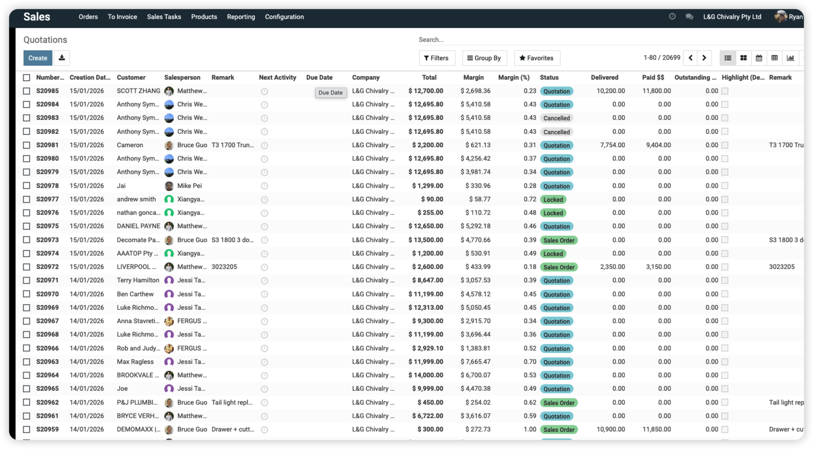

# 
 ODOO User Handbook for Chivalry 

- [ ODOO User Handbook for Chivalry ](#-odoo-user-handbook-for-chivalry-)
- [Sales and Invocing](#sales-and-invocing)
- [Purchase Process](#purchase-process)
- [Product Management](#product-management)
- [Inventory Management](#inventory-management)
- [Inter-company transfer](#inter-company-transfer)
- [Cash Management](#cash-management)
- [Meta-data Management](#meta-data-management)
    - [Vehicle Models](#vehicle-models)
    - [Packages](#packages)
    - [3D parts](#3d-parts)
- [Reporting](#reporting)
    - [Sales Report](#sales-report)
    - [Margin Report](#margin-report)
    - [Inventory Report](#inventory-report)
- [Other Resources](#other-resources)
    - [HTML URL to this file](#html-url-to-this-file)
    - [markdown how to use (cheatsheet)](#markdown-how-to-use-cheatsheet)
    - [how to include a picture/snapshot](#how-to-include-a-picturesnapshot)

# Sales and Invocing

# Purchase Process

# Product Management

# Inventory Management

# Inter-company transfer

# Cash Management

# Meta-data Management
### Vehicle Models
### Packages
### 3D parts

# Reporting
### Sales Report
### Margin Report
### Inventory Report

# Other Resources
### HTML URL to this file
https://ryanniuu.github.io/lgc-odoo/handbook.html
### markdown how to use (cheatsheet)
https://www.markdownguide.org/cheat-sheet/
### how to include a picture/snapshot

